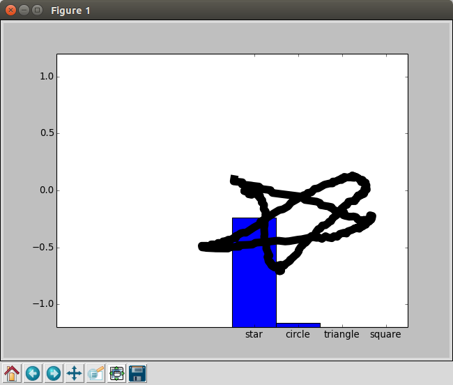
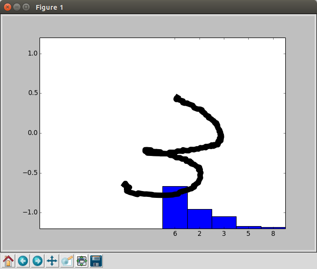

# What is
- Gesture recognition program using Caffe.
- This repository is work in progress.  Accuracy of classfication is very low.

# Prerequisites
- Invensense MPU-6050
  - In my case, I use SparkFun Breakout board.
- Arduino
  - Sketch: https://github.com/jrowberg/i2cdevlib
  - Use MPU6050_DMP6 sketch and enable OUTPUT_READABLE_QUATERNION
- Trained Caffe model
  - Use receive.py to collect dataset.
  - Train your model.  NVIDIA/DIGITS is good tool for training and manage models.

# Source code
- recieve.py
  - Record gesture and save as png image.
- solver.py
  - Input gesture and calassify which kind of gesture.

# Screenshots

